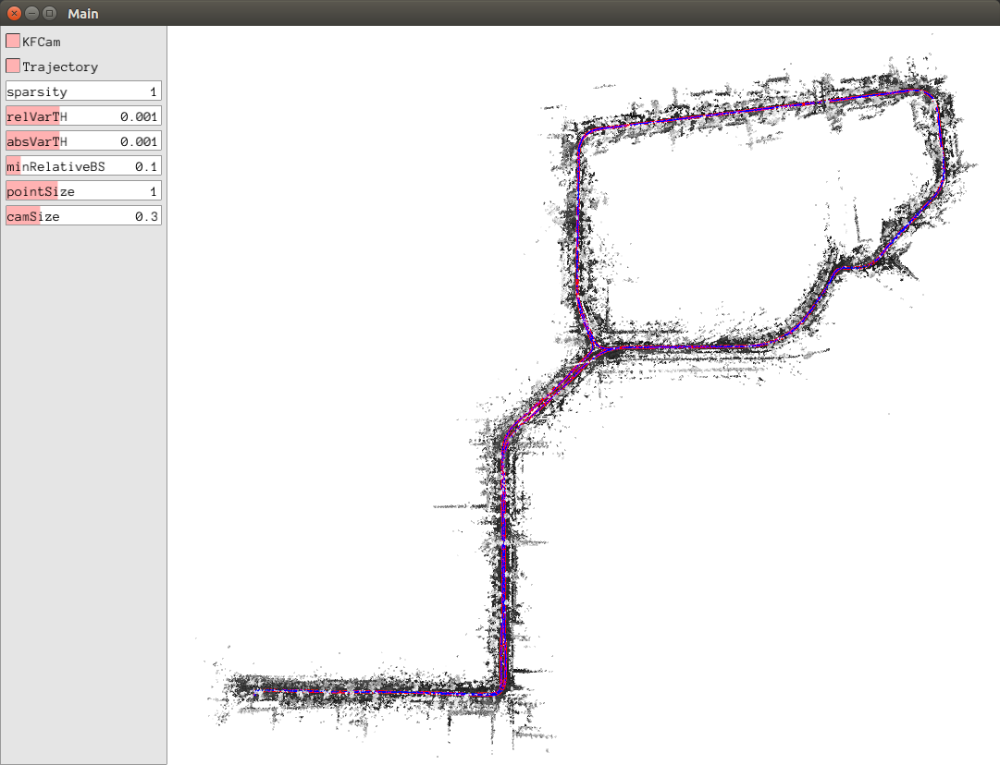

# MLAD Challenge Point Cloud Viewer
A simple point cloud viewer for visualizing the data of [MLAD challenge](https://sites.google.com/view/mlad-eccv2020/challenge), ECCV 2020.

### 1. Installation

#### 1.1 Required Dependencies

The viewer downloads and compiles [Pangolin](https://github.com/stevenlovegrove/Pangolin), [Eigen](http://eigen.tuxfamily.org/index.php?title=Main_Page), and [Sophus](https://github.com/strasdat/Sophus) automatically to the `thirdparty/` folder during compiling, so you need to make sure that your system fulfills the requirements of those 3 libraries.

#### 1.2 Build

		mkdir build
		cd build
		cmake ..
		make -j6

### 2 Usage

		bin/pcViewer_dataset data=${DATA_PATH}/recording_2020-03-24_17-36-22

### 3 Acknowledgements
The point cloud viewer is inherited from the viewer of [Direct Sparse Odometry](https://github.com/JakobEngel/dso) from Jakob Engel. We also would like to thank Parika Goel for her contribution to the point cloud viewer during her internship at Artisense. 